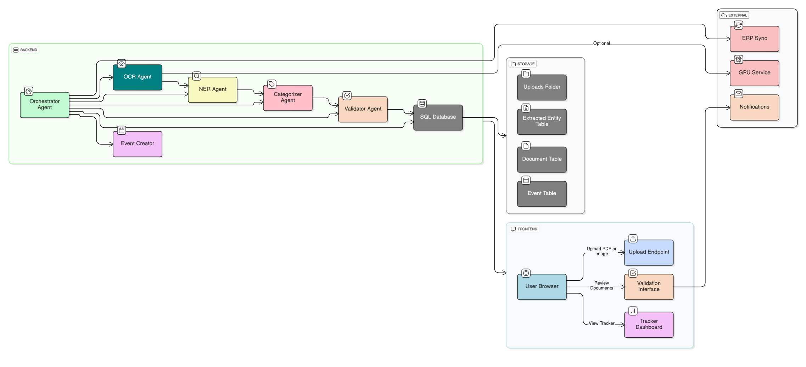

# 🧠 Multi-Agent AI Event Tracker

> An intelligent document processing system that automatically extracts, categorizes, and validates academic event reports using specialized AI agents.

[](https://www.python.org/)
[](https://reactjs.org/)
[](https://flask.palletsprojects.com/)
[](LICENSE)

## 📋 Table of Contents

- [Overview](#-overview)
- [Architecture](#-architecture)
- [Key Features](#-key-features)
- [Tech Stack](#-tech-stack)
- [Prerequisites](#-prerequisites)
- [Installation](#-installation)
- [Default Credentials](#-default-credentials)
- [Usage](#-usage)
- [Troubleshooting](#-troubleshooting)
- [Development](#-development)
- [Credits](#-credits)

---

## 🎯 Overview

The **Multi-Agent AI Event Tracker** is an enterprise-grade document intelligence system built for academic institutions. It processes uploaded event reports (PDFs, images) through a pipeline of specialized AI agents that:

- **Extract** text from both scanned and digital documents
- **Identify** key information (dates, venues, organizers, departments)
- **Categorize** events into predefined types
- **Validate** completeness and accuracy of extracted data
- **Store** structured results in a queryable database

Perfect for colleges tracking student activities, department events, workshops, conferences, and project reports.

---

## 🏗️ Architecture

### System Overview



### AI Agent Pipeline

| Agent | Role | Technology |
|-------|------|------------|
| **🔍 OCR Agent** | Extracts text from documents | PaddleOCR + PyMuPDF |
| **🏷️ NER Agent** | Identifies entities (dates, venues, orgs) | spaCy NER |
| **📁 Categorizer Agent** | Classifies event types & departments | Rule-based + ML |
| **✅ Validator Agent** | Validates extracted data quality | Business rules |
| **🎭 Orchestrator Agent** | Coordinates the entire pipeline | Flask backend |

Each agent operates independently, making the system modular, scalable, and easy to extend.

---

## 🚀 Key Features

✅ **Hybrid OCR Processing** - Handles both scanned images and digital PDFs  
✅ **Intelligent NER** - Automatically extracts event metadata  
✅ **Auto-Categorization** - Classifies events into workshops, conferences, reports, etc.  
✅ **Multi-Role Dashboard** - Student, Teacher, and IQC Admin interfaces  
✅ **Department Tracking** - Monitor progress across AIML, CSE-DS, CSE-CY, etc.  
✅ **Abstract Extraction** - Summarizes document content automatically  
✅ **JWT Authentication** - Secure role-based access control  
✅ **CSV Export** - Generate reports for analysis  
✅ **Real-time Validation** - Immediate feedback on data quality  

---

## 🛠️ Tech Stack

### Backend
- **Framework:** Flask 3.0+
- **Database:** SQLAlchemy (SQLite/PostgreSQL/MySQL)
- **AI/ML:** PaddleOCR, spaCy, PyMuPDF
- **Auth:** JWT (Flask-JWT-Extended)
- **Migrations:** Alembic

### Frontend
- **Framework:** React 18+
- **Styling:** TailwindCSS
- **Charts:** Chart.js
- **HTTP Client:** Axios
- **Routing:** React Router

---

## 📦 Prerequisites

Before you begin, ensure you have:

- 🐍 **Python 3.10+** (3.11 recommended)
- ⚙️ **Node.js 18+**
- 📦 **npm** or **yarn**
- 🧭 **Git**

---

## 🚀 Installation

### Option 1: Quick Start (Recommended)

#### Backend Setup

```bash
# Navigate to backend
cd backend

# Create and activate virtual environment (Windows PowerShell)
python -m venv venv
Set-ExecutionPolicy -Scope Process -ExecutionPolicy Bypass
.\venv\Scripts\activate

# For macOS/Linux
python3 -m venv venv
source venv/bin/activate

# Install dependencies
pip install -r requirements.txt

# Install spaCy English model
pip install https://github.com/explosion/spacy-models/releases/download/en_core_web_sm-3.7.1/en_core_web_sm-3.7.1.tar.gz

# Initialize database
flask db upgrade

# (Optional) Create default users
curl -X POST http://localhost:5000/api/init

# Start backend server
python main.py
```

**Backend will run at:** `http://localhost:5000`

#### Frontend Setup

```bash
# Open a new terminal and navigate to frontend
cd frontend

# Install dependencies
npm install

# Start development server
npm start
```

**Frontend will run at:** `http://localhost:3000`

### Option 2: Production Deployment

```bash
# Backend with Gunicorn
cd backend
gunicorn --bind 0.0.0.0:5000 --workers 4 main:app

# Frontend build
cd frontend
npm run build
# Serve the 'build' folder with nginx or any static server
```

---

## 🔑 Default Credentials

Use these credentials to log in after initialization:

| Role | Username | Password | Department | Permissions |
|------|-----------|-----------|-------------|-------------|
| 👨‍🎓 Student | `student1` | `student1` | AIML | Upload documents, view own submissions |
| 👨‍🎓 Student | `student2` | `student2` | CSE-DS | Upload documents, view own submissions |
| 👨‍🏫 Teacher | `teacher1` | `teacher1` | CSE (Core) | Review department submissions |
| 👨‍🏫 Teacher | `teacher2` | `teacher2` | AIML | Review department submissions |
| 👨‍🏫 Teacher | `teacher3` | `teacher3` | CSE-CY | Review department submissions |
| 🛡️ IQC Admin | `iqc` | `iqc123` | ALL | Full system access, analytics, reports |

> ⚠️ **Security Note:** Change these default passwords in production environments.

---

## 💻 Usage

### Basic Workflow

1. **Login** with appropriate credentials
2. **Upload** a document (PDF or image)
3. **Wait** for AI agents to process (~10-30 seconds)
4. **Review** extracted information
5. **Approve/Edit** as needed
6. **Export** reports to CSV

### API Examples

#### Login
```bash
curl -X POST http://localhost:5000/api/auth/login \
  -H "Content-Type: application/json" \
  -d '{"username":"student1","password":"student1"}'
```

#### Upload Document
```bash
curl -X POST http://localhost:5000/api/documents/upload \
  -H "Authorization: Bearer YOUR_JWT_TOKEN" \
  -F "file=@event_report.pdf"
```

#### Get All Events
```bash
curl -X GET http://localhost:5000/api/events \
  -H "Authorization: Bearer YOUR_JWT_TOKEN"
```

---

## 🔧 Troubleshooting

### Common Issues & Solutions

| Problem | Solution |
|---------|----------|
| **OCR too slow** | Reduce DPI in [ocr_agent.py](backend/agents/ocr_agent.py): `pix = page.get_pixmap(dpi=100)` |
| **OCR init failed** | Manually install: `pip install paddleocr paddlepaddle` |
| **spaCy model missing** | Download via the URL in installation steps above |
| **CORS / Proxy errors** | Ensure frontend `package.json` has `"proxy": "http://localhost:5000"` |
| **Login fails** | Run the `/api/init` endpoint to recreate default users |
| **Database locked** | Close all connections, or delete `backend/*.db` and re-run `flask db upgrade` |
| **Port already in use** | Kill process on port 5000: `netstat -ano | findstr :5000` then `taskkill /PID <pid> /F` |

### Rebuild Environment

If you encounter persistent issues:

```bash
# Windows
rmdir /s /q venv
python -m venv venv
.\venv\Scripts\activate
pip install -r requirements.txt

# macOS/Linux
rm -rf venv
python3 -m venv venv
source venv/bin/activate
pip install -r requirements.txt
```

### Database Reset

```bash
# Remove existing database
# Make sure to backup first!
rm backend/your_database.db

# Reinitialize
flask db upgrade
curl -X POST http://localhost:5000/api/init
```

---

## 👨‍💻 Development

### Project Structure

```
MAJOR PROJECT/
├── backend/               # Flask API & AI agents
│   ├── agents/           # Multi-agent system
│   │   ├── ocr_agent.py
│   │   ├── ner_agent.py
│   │   ├── orchestrator_agent.py
│   │   └── validator_agent.py
│   ├── migrations/       # Alembic database migrations
│   ├── ml_models/        # Trained models
│   ├── static/uploads/   # Uploaded documents
│   ├── main.py          # Flask app entry point
│   ├── models.py        # SQLAlchemy models
│   └── config.py        # Configuration
├── frontend/             # React dashboard
│   ├── src/
│   │   ├── components/
│   │   ├── pages/
│   │   └── App.js
│   └── package.json
└── README.md
```

### Git Workflow

```bash
# Pull latest changes
git pull origin main

# Create feature branch
git checkout -b feature/your-feature-name

# Make changes, then commit
git add .
git commit -m "feat: add new feature description"

# Push and create pull request
git push origin feature/your-feature-name
```

### Common Development Commands

```bash
# Run backend in debug mode
cd backend
python main.py

# Run frontend with hot reload
cd frontend
npm start

# Run database migrations
cd backend
flask db migrate -m "description"
flask db upgrade

# Clean build artifacts
git clean -fdx
```

### Adding a New Agent

1. Create agent file in `backend/agents/your_agent.py`
2. Inherit from base agent class
3. Implement `process()` method
4. Register in `orchestrator_agent.py`

---

## 📊 Performance Metrics

- **OCR Processing:** ~5-15 seconds per document (digital PDFs faster)
- **NER Extraction:** ~2-5 seconds per document
- **Total Pipeline:** ~10-30 seconds per document
- **Accuracy:** ~85-95% for well-formatted documents

---

## 🤝 Contributing

Contributions are welcome! Please follow these steps:

1. Fork the repository
2. Create a feature branch
3. Make your changes with clear commit messages
4. Submit a pull request

---

## 📄 License

This project is licensed under the MIT License. See [LICENSE](LICENSE) for details.

---

## 📧 Support

- **Issues:** [GitHub Issues](https://github.com/yourusername/multi-agent-event-tracker/issues)
- **Documentation:** See [PROJECT_SUMMARY.md](PROJECT_SUMMARY.md) for detailed architecture
- **Contact:** For questions, contact the development team

---

## 👏 Credits

**Developed by:** Aman Sheikh  
**Purpose:** Pattern Recognition and Machine Learning Case Study  
**Institution:** [Your Institution Name]  
**Year:** 2026

### Acknowledgments

- **PaddleOCR** for OCR capabilities
- **spaCy** for NER functionality
- **Flask** and **React** communities for amazing frameworks

---

<div align="center">

**⭐ Star this repo if you find it helpful! ⭐**

Made with ❤️ for academic excellence

</div>
